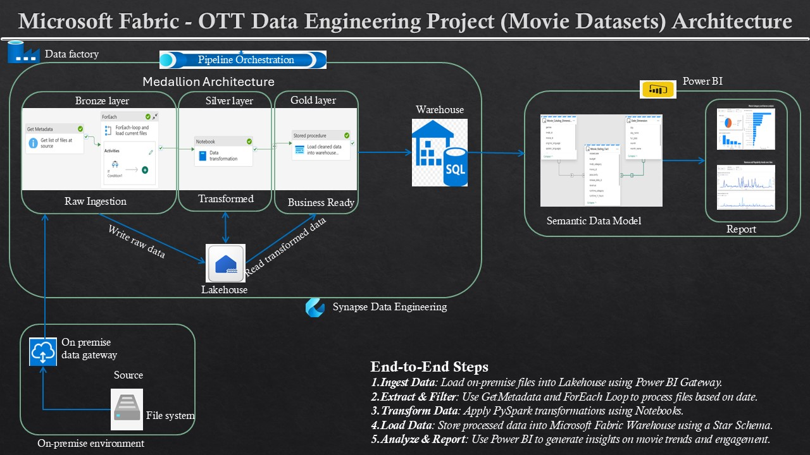

# 🎬 OTT Platform Data Engineering Project using Microsoft Fabric (Movie Datasets)

## 📌 Project Overview
This project builds an end-to-end ETL pipeline for an OTT platform  using **Microsoft Fabric**. The goal is to ingest on-premise data, transform it, and load it into a structured format for reporting and analysis in **Power BI**.

## 🚀 Technologies Used
- **Microsoft Fabric** (OneLake, Data Factory, Warehouse, Notebooks)
- **Power BI** (Visualization & Reporting)
- **PySpark** (Transformation using Notebooks)
- **SQL** (Star Schema & Data Warehouse)
- **Power BI Gateway** (On-Prem Data Access)

---

## 🔧 Project Architecture
### 📌 Data Flow
1. **Ingestion**: Load on-premise file storage data into **OneLake** using **Power BI Gateway**.
2. **Transformation**: Process and clean data using **Notebooks** and **Stored Procedures**.
3. **Storage**: Store refined data in **Lakehouse tables (Silver Layer)**.
4. **Warehouse & Modeling**: Load structured data into **Fabric Warehouse** and create a **Star Schema**.
5. **Reporting**: Use **Power BI** to visualize and analyze trends in OTT platform performance.

---

## 📂 Datasets   
 **Dataset fields** 

- **id**: Unique identifier for each movie. (int)

- **title**: Title of the movie. (str)

- **vote_average**: Average vote or rating given by viewers. (float)

- **vote_count**: Total count of votes received for the movie. (int)

- **status**: The status of the movie (e.g., Released, Rumored, Post Production, etc.). (str)

- **release_date**: Date when the movie was released. (str)

- **revenue**: Total revenue generated by the movie. (int)

- **runtime**: Duration of the movie in minutes. (int)

- **adult**: Indicates if the movie is suitable only for adult audiences. (bool)

- **budget**: Budget allocated for the movie. (int)

- **imdb_id**: IMDb ID of the movie. (str)

- **original_language**: Original language in which the movie was produced. (str)

- **original_title**: Original title of the movie. (str)

- **popularity**: Popularity score of the movie. (float)

- **genres**: List of genres the movie belongs to. (str)

- **spoken_languages**: List of languages spoken in the movie. (str)

[Sample data](data/).    
Data Source: [TMDB Movies Dataset (2023)](https://www.kaggle.com/datasets/asaniczka/tmdb-movies-dataset-2023-930k-movies?resource=download).

---

## 🛠️ Setup Instructions
### **1️⃣ Prerequisites**
- Microsoft Fabric workspace
- Power BI account
- On-prem data stored in CSV

### **2️⃣ Environment Setup**
1. Set up **Microsoft Fabric** workspace.
2. Configure **OneLake-Lakehouse** for data storage.
3. Set up **Power BI Gateway** for on-prem file access.
4. Deploy **Data Factory** pipeline (`data-ingestion/ingest_pipeline.json`).
5. Create **Warehouse Schema** using [schema.sql](warehouse/schema.sql).
6. Deploy **Power BI Dashboard** from `reporting/powerbi_dashboard.pbix`.

---

## 🔄 Pipeline Workflow
1. **Extract filenames** using **GetMetadata**.
2. **ForEach Loop** processes each file:
   - **If Condition** checks if file’s date matches the current date.
   - **Copy Activity** loads the matching file into **Lakehouse (Silver Layer)**.
3. **Notebook Activity** transforms data using **PySpark**.
4. **Stored Procedure Activity** runs: [Stored_Procedure](warehouse/Stored_Procedure_for_Daily_Updates.sql).
   - **MERGE** for Dimension Tables.
   - **APPEND** for the Fact Table.

---

## 📊 Power BI Dashboards
### 📌 Reports Built:
1. **Top-Performing Genres** 🎭
   - Uses **Movie Rating Fact Table** and **Movie Catalog Dimension**.
   - Aggregates **vote_count** and **popularity**.
   - Displayed as a **bar chart**.

2. **Trends in Movie Viewership** 📈
   - Uses **Date Dimension** and **Movie Rating Fact Table**.
   - Tracks **popularity & view counts** over time.
   - Shown as a **line chart**.

3. **User Engagement Insights** 👥
   - Analyzes **runtime categories** and their impact.
   - Uses a **heatmap & scatter plot**.

---

## 🔍 Monitoring & Alerts
- **Fabric Data Factory Monitoring** for pipeline execution.
- **Power BI Alerts** for report updates.

---

## 🌟 Future Enhancements
- **Real-time Streaming** for live user activity tracking.
- **AI-Based Recommendations** using machine learning in Fabric.
- **Integration with Dataverse** for deeper insights.

---

## 🤝 Contributing
1. Fork this repo & clone locally.
2. Create a feature branch (`feature-new-component`).
3. Commit changes and push.
4. Open a pull request.

---

## 📝 License
MIT License

---

### 🔗 Connect with Me
📧 Email: astero2gk@gmail.com
🔗 LinkedIn: [Profile](https://www.linkedin.com/in/frank-adane-b927455)  
🚀 GitHub: [GitHub](https://github.com/frankadane)
